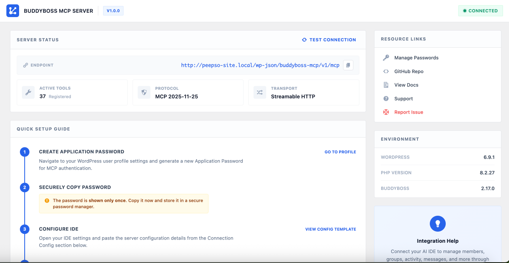
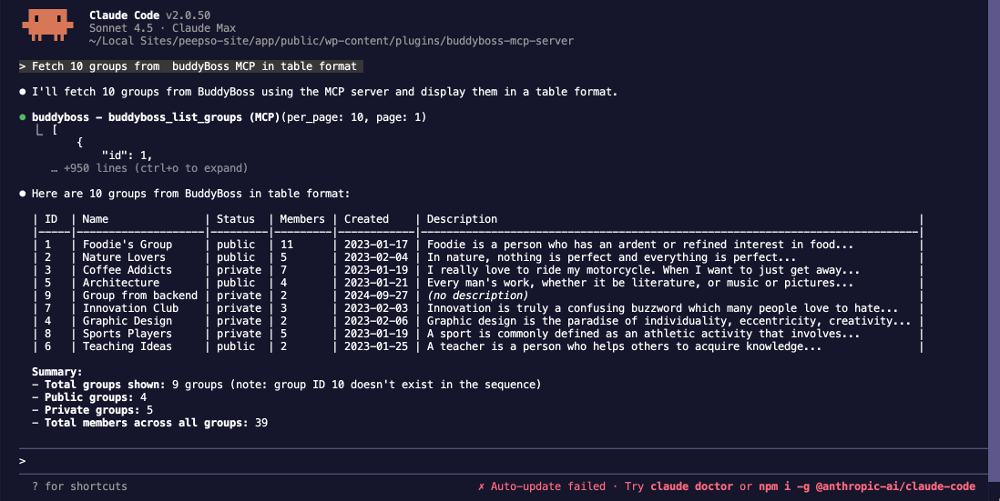

# BuddyBoss MCP Server

A WordPress plugin that exposes your [BuddyBoss Platform](https://www.buddyboss.com/) as an [MCP (Model Context Protocol)](https://modelcontextprotocol.io/) server, enabling AI-powered IDEs to manage your BuddyBoss community through natural language.

> **Upload ZIP, activate, connect** — no Node.js, no Composer, no CLI required on the server.

### Admin Dashboard



### Live Demo — Fetching BuddyBoss Groups via Claude Code



---

## What Is This?

BuddyBoss MCP Server turns your WordPress site into an MCP-compatible endpoint. Once connected, you can ask your AI assistant things like:

- *"List all public groups with more than 5 members"*
- *"Create a private group called Design Team"*
- *"Add user #12 to the Architecture group as a moderator"*
- *"Show me the latest activity feed"*
- *"Send a message to all group admins"*

The AI translates your instructions into BuddyBoss API calls automatically.

---

## Requirements

- **WordPress** 5.6+ (for Application Passwords)
- **BuddyBoss Platform** 2.0+ (must be active)
- **PHP** 7.4+
- **HTTPS** enabled (required for Application Passwords; localhost is exempt)

---

## Quick Start

1. Upload and activate the plugin
2. Create an Application Password in your WordPress profile
3. Add the connection config to your AI client
4. Start managing your BuddyBoss site with natural language

See the [Setup & Connection Guide](docs/setup-guide.md) for detailed step-by-step instructions.

---

## Available Tools (65)

All tools follow the naming convention: `buddyboss_{verb}_{resource}`. See the [docs/knowledge/](docs/knowledge/) directory for full parameter details on each tool.

### Phase 1: Core Tools (37) — Always Enabled

| Category | Tools | Documentation |
|----------|-------|---------------|
| **Members** | 5 tools — list, get, create, update, delete members | [members.md](docs/knowledge/members.md) |
| **Groups** | 8 tools — CRUD groups + list/add/remove members | [groups.md](docs/knowledge/groups.md) |
| **Activity** | 6 tools — activity feed CRUD + favorites | [activity.md](docs/knowledge/activity.md) |
| **Messages** | 5 tools — threads, send, delete, mark read | [messages.md](docs/knowledge/messages.md) |
| **Friends** | 4 tools — list, add, remove friends + requests | [friends.md](docs/knowledge/friends.md) |
| **Notifications** | 4 tools — list, get, mark read, delete | [notifications.md](docs/knowledge/notifications.md) |
| **XProfile** | 5 tools — profile field groups, fields, data | [xprofile.md](docs/knowledge/xprofile.md) |

### Phase 2: BuddyBoss Tools (18) — Coming Soon

| Category | Tools | Documentation |
|----------|-------|---------------|
| **Media / Photos** | 5 tools — list, get, upload, update, delete | [media.md](docs/knowledge/media.md) |
| **Video** | 4 tools — list, get, upload, delete | [video.md](docs/knowledge/video.md) |
| **Documents** | 5 tools — list, get, upload, delete + folders | [documents.md](docs/knowledge/documents.md) |
| **Moderation** | 4 tools — reports, block/unblock members | [moderation.md](docs/knowledge/moderation.md) |

### Phase 3: Advanced Tools (10) — Coming Soon

| Category | Tools | Documentation |
|----------|-------|---------------|
| **Forums** | 6 tools — forums, topics, replies | [forums.md](docs/knowledge/forums.md) |
| **LearnDash** | 4 tools — courses, enrollment, progress | [learndash.md](docs/knowledge/learndash.md) |

---

## Architecture

```
AI IDE (Claude Code / Cursor / VS Code)
  |
  v
POST /wp-json/buddyboss-mcp/v1/mcp
Authorization: Basic base64(username:app_password)
  |
  v
REST_Controller --> MCP_Server --> Tool_Registry --> Tool Provider --> Internal_REST_Client --> BuddyBoss REST API
```

| Decision | Choice | Why |
|----------|--------|-----|
| Language | Pure PHP 7.4+ | No Composer/Node.js needed — upload ZIP and activate |
| Transport | Streamable HTTP (POST + JSON) | Current MCP transport, works behind any proxy/CDN |
| Auth | WordPress Application Passwords | Built into WP 5.6+, per-app revocable, HTTPS-enforced |
| Tool execution | `rest_do_request()` internal dispatch | Reuses BuddyBoss validation with zero HTTP overhead |

For detailed architecture, see [docs/architecture.md](docs/architecture.md).

---

## Protocol

The plugin implements [MCP specification 2025-11-25](https://modelcontextprotocol.io/specification/2025-11-25) over JSON-RPC 2.0 using **Streamable HTTP** transport — the current recommended MCP transport. Our implementation uses the POST-only subset: a single endpoint, stateless, no sessions.

For protocol details, supported methods, and error codes, see [docs/mcp-protocol.md](docs/mcp-protocol.md).

---

## Extending with Custom Tools

Add your own tools via the `bbmcp_tool_providers` filter:

```php
add_filter( 'bbmcp_tool_providers', function( $providers ) {
    require_once __DIR__ . '/class-my-custom-tools.php';
    $providers[] = new My_Custom_Tools();
    return $providers;
} );
```

Your tool class must extend `BuddyBossMCP\Tools\Tool_Base`. See the [Extending Tools Guide](docs/extending-tools.md) for the full API reference, a complete WordPress Posts example, and tips.

---

## Security

| Layer | Protection |
|-------|-----------|
| **Transport** | HTTPS required (Application Passwords enforce this) |
| **Authentication** | WordPress Application Passwords (Basic Auth) |
| **Authorization** | `manage_options` capability — admin-only access |
| **Input validation** | WordPress sanitization functions on all tool parameters |
| **Permissions** | `rest_do_request()` enforces BuddyBoss endpoint permissions |

For security best practices, see the [Setup Guide](docs/setup-guide.md#security-best-practices).

---

## Troubleshooting

Common issues and fixes are covered in the [Setup Guide](docs/setup-guide.md#troubleshooting).

---

## Documentation

| Document | Description |
|----------|-------------|
| [Setup Guide](docs/setup-guide.md) | Installation, connection, testing, troubleshooting |
| [Architecture](docs/architecture.md) | System design, request flow, extending |
| [MCP Protocol](docs/mcp-protocol.md) | JSON-RPC 2.0 implementation details |
| [Tool Reference](docs/tool-reference.md) | All 65 tools with parameters |
| [Extending Tools](docs/extending-tools.md) | Add your own custom MCP tools |
| [API Research](docs/api-research.md) | BuddyBoss REST API endpoint analysis |

---

## Why BuddyBoss MCP Server?

Most MCP servers for WordPress run as **separate Node.js processes** that make external HTTP calls back to your site. This plugin takes a fundamentally different approach — it runs **natively inside WordPress**.

| | External MCP Server (Node.js) | BuddyBoss MCP Server (This Plugin) |
|--|-------------------------------|-------------------------------------|
| **Installation** | Clone repo, `npm install`, configure `.env` | Upload ZIP, activate — done |
| **Runtime** | Separate Node.js process alongside WordPress | Runs inside WordPress itself |
| **API calls** | External HTTP requests to `wp-json/` (network latency + overhead) | Internal `rest_do_request()` — zero HTTP overhead |
| **Authentication** | Environment variables, custom token management | WordPress Application Passwords (built-in, revocable) |
| **Permissions** | Must replicate WordPress permission checks | Inherits WordPress + BuddyBoss permissions automatically |
| **Dependencies** | `@modelcontextprotocol/sdk`, `node-fetch`, Node.js runtime | None — pure PHP, no external dependencies |
| **Server management** | Must keep Node.js process running (PM2, systemd, etc.) | Always available when WordPress is running |
| **Updates** | Manual git pull + npm install | Standard WordPress plugin update flow |
| **Tools** | 36 (BuddyPress only) | 65 (BuddyBoss-specific features included) |
| **Extensibility** | Write JavaScript, restart server | WordPress filter hook — no restart needed |

**The key advantage:** because the plugin lives inside WordPress, every tool call goes through the same validation, sanitization, and permission checks that BuddyBoss uses for its own REST API. There's no separate process to manage, no external HTTP calls to secure, and no permissions to duplicate.

---

## License

GPLv2 or later — [https://www.gnu.org/licenses/gpl-2.0.html](https://www.gnu.org/licenses/gpl-2.0.html)

---

## Credits

- **[BuddyBoss](https://www.buddyboss.com/)** — Community platform for WordPress
- **[Model Context Protocol](https://modelcontextprotocol.io/)** — Open standard by Anthropic
- **[BuddyPress MCP](https://github.com/vapvarun/buddypress-mcp)** — Reference implementation by vapvarun
